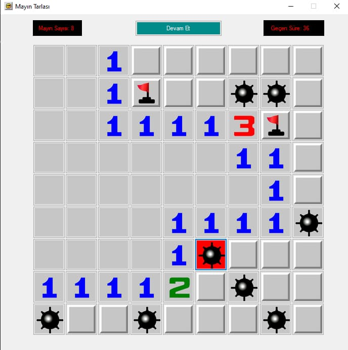

# Minesweeper

Classic Minesweeper game implemented in C# using Windows Forms for educational purposes.

---

## About
This project was developed as a school assignment to practice desktop application development with C# and Windows Forms.

The goal was to recreate the classic Minesweeper game logic, grid handling, and user interactions in a native Windows environment rather than focusing on modern UI frameworks.

The entire project is written in Turkish, as it was developed for a school course.

- Classic Minesweeper gameplay
- Windows Forms (WinForms) UI
- Grid-based game logic
- Mine generation and win/lose conditions
- Desktop-focused implementation

---

## Screenshots

In Game: 

---

## Getting Started

### Requirements
- Windows OS
- .NET Framework 4.7.2
- Visual Studio (recommended)

### Installation
1. Clone the repository
2. Open the `.sln` file with Visual Studio
3. Restore dependencies if prompted
4. Build and run the project
